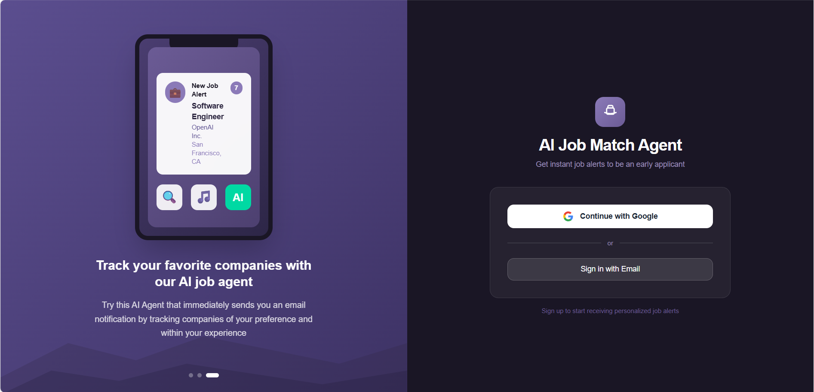
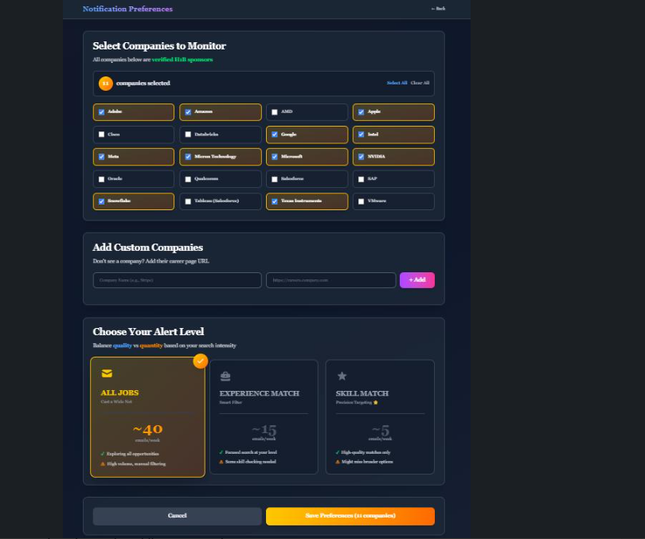
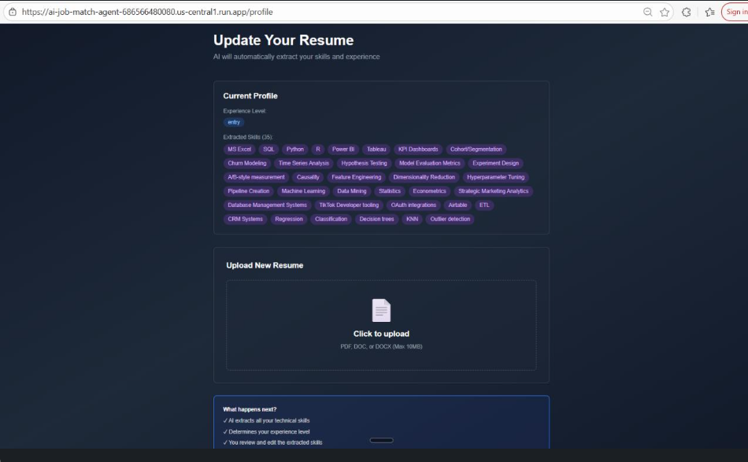

# AI Job Match Agent

An intelligent job matching platform specifically designed for talent seeking jobs freshly posted on company career sites. Uses **AI-powered resume parsing** and (in-progress) **semantic matching** to connect job seekers with relevant postings.

🔗 Live website: https://ai-job-match-agent-686566480080.us-central1.run.app

---

## 📸 Product Walkthrough (Screenshots)

### 1) Sign in and get started

### 2) Upload your resume — AI extracts your skills automatically

### 3) Monitor companies + control your alert intensity (quality vs quantity)

---

## 🧩 The Story (Why I Built This)

New grads often lose opportunities **not because they aren’t qualified**, but because they aren’t early.

Many roles hit **100+ applicants** quickly due to aggregators and big job boards surfacing them instantly. By the time you find the posting, the competition is already stacked.

So I built **AI Job Match Agent** to restore the timing advantage:
- You choose the companies you care about
- The platform monitors their career pages
- You get alerted as soon as a new role appears
- You can choose whether you want **more alerts** (quantity) or **fewer, high-quality alerts** (precision)

---

## 🎯 Problem Statement

New college graduates struggle to become early applicants at companies they want to work for due to intense competition and job posts getting flooded quickly. This platform aims to inform applicants immediately when a new job listing appears. It solves that by:
- Using **AI semantic matching** to surface relevant opportunities (in progress)
- Providing **customizable notification levels** (quality vs quantity)

---

## 🏢 Companies Monitoring System (Core Feature)

The monitoring system is built around **control**:

- **Monitor a curated list of companies** (H1B-first / sponsorship-friendly list)
- **Add custom companies** by pasting a careers page URL
- Choose your alert level based on how many emails you want to manage:

**Notification levels (quality vs quantity):**
- **All Jobs (~40/week):** Cast a wide net
- **Experience Match (~15/week):** Filter by seniority level
- **Skill Match (~5/week):** High-precision targeting

This design ensures alerts don’t become noise — users can tune the agent to match their search intensity.

---

## ✨ Features

### Completed
- ✅ **AI Resume Parsing**: Upload PDF resume → Gemini 2.0 Flash extracts skills automatically
- ✅ **Smart Profile Management**: Edit skills, set experience level, vector embeddings for matching
- ✅ **Custom Company Addition**: Add any company's career page you want to monitor
- ✅ **Notification Preferences**:
  - **All Jobs** (~40/week): Cast a wide net
  - **Experience Match** (~15/week): Filter by seniority level
  - **Skill Match** (~5/week): High-precision targeting
- ✅ **Dark Theme UI**: Professional design with Times New Roman serif typography

### In Progress
- 🚧 **AI Matching Engine**: Cosine similarity on resume/job embeddings
- 🚧 **Job Display**: Show matched jobs with similarity scores + reasoning
- 🚧 **Web Scrapers**: Automated job collection from company career pages

---

## 🛠️ Tech Stack

- **Frontend**: Next.js 14 (App Router), TypeScript, Tailwind CSS
- **Backend**: Next.js API Routes, Supabase (PostgreSQL + pgvector)
- **AI/ML**: Google Gemini 2.0 Flash (resume parsing), Vector embeddings (768-dim)
- **Database**: PostgreSQL with pgvector extension for semantic searching
- **Auth**: Supabase Auth

---
